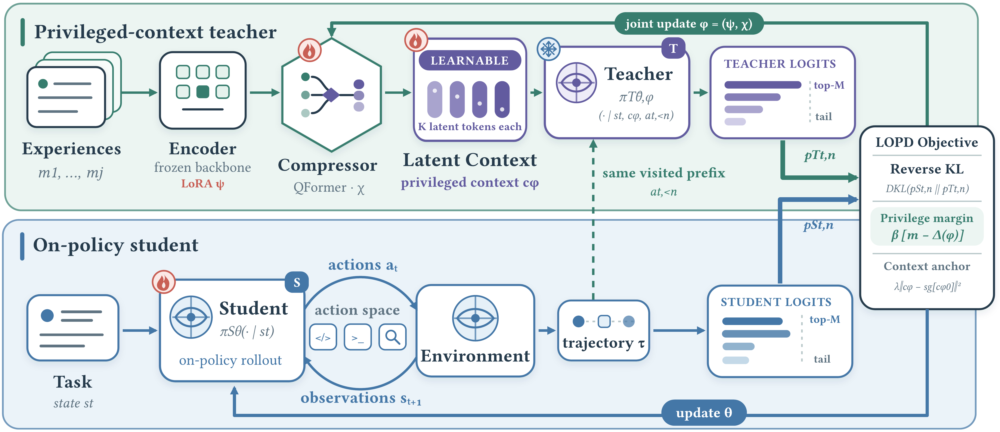

# LOPD: Latent On-Policy Self-Distillation

**Guibin Zhang\*, Jiayang Lyu\*, Ran Sun, Xinlei Yu, Haoyu Zhao, Qibing Ren†, Shuicheng Yan†**

[](https://arxiv.org/abs/2608.13040)
[](LICENSE)

## Overview

**LOPD** is a self-distillation framework that makes the teacher's privileged context *learnable end-to-end* from experience, rather than relying on designer-specified artifacts such as answers, skills, or trajectories. It retrieves relevant past trajectories, compresses them into continuous latent tokens that condition a privileged self-teacher, and provides dense token-level supervision on the student's own rollouts. A privileged-margin objective stabilizes the learning of latent context. At inference time, the deployed student requires no retrieval, compression, or latent tokens. LOPD outperforms RLVR and representative OPSD methods across agentic tool-use and code generation, while surpassing GRPO and Skill-SD with less than 30% of their rollout budget.

<p align="center">
  
</p>

## Updates

- **2026-08-14**: Initial code release. Training code coming soon — integrating the latent memory mechanism into the training pipeline involves substantial complexity and will be released separately.

## Installation

```bash
git clone https://github.com/bingreeky/LOPD.git
cd LOPD
conda create -n lopd python=3.10 -y && conda activate lopd
pip install -r requirements.txt
```

## Quick Start

Before running, replace placeholder values such as `YOUR_MODEL_PATH` in the selected YAML config with your local paths.

### Normal Inference

```bash
python -m inference.run --config configs/inference/envscaler/envscaler_eval200_qwen3_4b.yaml
```

### Latent Memory Inference

```bash
python -m inference.run_with_latent --config configs/inference/envscaler/envscaler_latent_eval200_qwen3_4b.yaml
```

## Repository Structure

```
LOPD/
├── interaction/  # ReAct agent, episode runner, inference spec
├── envs/         # Environment implementations (EnvScaler)
├── backends/     # LLM inference backends (SGLang, vLLM)
├── memory/       # Latent memory: QFormer, FAISS bank, compression
├── inference/    # Inference entry points and rollout
├── utils/        # Tools: build bank, create/merge LoRA
├── config.py     # Configuration loading and builder functions
└── configs/      # YAML configuration templates
```

## Results

LOPD achieves the best aggregate result across all backbone–benchmark comparisons.

### Agentic Tool-Use

| LLM | Method | EnvScaler | BFCL V3 | ACEBench |
|-----|--------|-----------|---------|----------|
| Qwen3-4B | Vanilla | 48.6 | 22.88 | 50.6 |
| | GRPO | 61.8 | 25.25 | 56.0 |
| | Skill-SD | 59.1 | 24.63 | 56.0 |
| | SDFT | 50.3 | 21.75 | 50.0 |
| | OPSD | 51.2 | 25.13 | 48.6 |
| | **LOPD** | **63.7** | **27.38** | **60.6** |
| Qwen3-8B | Vanilla | 49.2 | 28.38 | 54.6 |
| | GRPO | 57.3 | 29.00 | 58.0 |
| | Skill-SD | 60.2 | 27.38 | 56.0 |
| | SDFT | 56.2 | 26.88 | 54.7 |
| | OPSD | 52.0 | 25.75 | 52.7 |
| | **LOPD** | **66.4** | **29.88** | **62.7** |

### Code Generation

| LLM | Method | LCB Avg | HumanEval+ | MBPP+ |
|-----|--------|---------|------------|-------|
| Qwen3-4B | Vanilla | 45.61 | 85.37 | 75.93 |
| | GRPO | 48.29 | 86.59 | 76.19 |
| | SDFT | 47.07 | 87.20 | 76.98 |
| | **LOPD** | **48.78** | **87.80** | **78.57** |
| OLMo3-7B-Think | Vanilla | 46.34 | 86.59 | 70.37 |
| | GRPO | 48.29 | 89.02 | 72.75 |
| | SDFT | 46.58 | 89.02 | 73.02 |
| | **LOPD** | **50.98** | **90.24** | **73.28** |

## Checkpoints

| Model | Domain | Link |
|-------|--------|------|
| Qwen3-8B LOPD | Agentic | [🤗 HuggingFace](https://huggingface.co/liunanfu1992/Qwen3-8B-LOPD) |
| OLMo3-7B-Think LOPD | Coding | [🤗 HuggingFace](https://huggingface.co/liunanfu1992/OLMo-3-7B-Think-LOPD) |

## Citation

```bibtex
@article{zhang2026lopd,
  title={Latent On-Policy Self-Distillation},
  author={Guibin Zhang and Jiayang Lyu and Ran Sun and Xinlei Yu and Haoyu Zhao and Qibing Ren and Shuicheng Yan},
  journal={arXiv preprint arXiv:2608.13040},
  year={2026}
}
```

## License

This project is licensed under the Apache License 2.0. See [LICENSE](LICENSE) for details.
